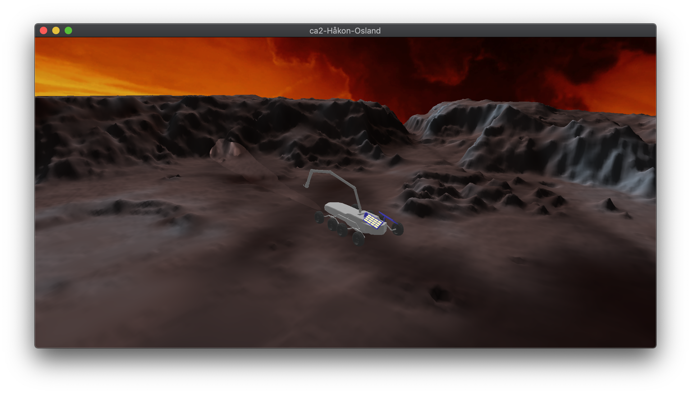

# Håkon Osland - ca4 - INF251
* Fixed the issue with copying pngs to the build directory
* Fixed the terrain in blender by deleting duplicate normals
* Loaded the terrain and texture
* Loaded my rovers body, and its arm as different models to make it easier to animate them
* Skybox is loaded, but has a special material property (shadeless) so that the lights don't affect it. Model taken from: https://forums.ashesofthesingularity.com/482281/tutorial-skybox---environment-cube
* Spotlight and pointlight are the same as last time, but i change the spotlights position and direction so that it is always points away from the rover
* Move camera direction with mouse, and translate in x direction by a,d z direction by ws, y direction by z, x.
* Make the arm move by pressing r, stop it by pressing t
* Start the automatic camera navigation by pressing c, stop it by pressing v
* You can move the rover by using the arrow keys. arm position is relative to the car so it doesen't look weird
* Skybox is rotated slightly when the camera position changes in x,z coordinates
* To rotate the arm i found the pivot point of the arm in blender. I first translate the arm into 0,0 then rotate it, and then translate it out to its previous position.
* Automatic camera rotation is relative to the rover so that it will always follow the rover when you move it.
* the automatic camera navigation and arm rotation is implemented using Catmull-Rom splines.
* i've included a demo video of the program in
  [screenrecordingfinal.mov](screenrecordingfinal.mov)

Some screenshots from the program:

